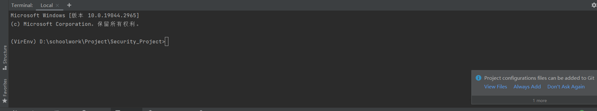
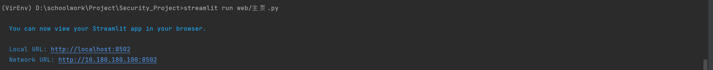

# 项目管理课程设计
## 项目简介
我们的软件名称是恶意文件防护软件，我们的目标是做出一款能对在一定范围内的类型的文件进行扫描，
并能识别出恶意文件的软件。操作系统关系到国家的信息安全，大力发展国产操作系统势在必行，而一个操
作系统的发展不仅在于其本身，而且与其配套的相关软件生态也息息相关。
该软件的部分功能基于开源杀毒软件 Clamav。我们计划做出以下五个模块：三个扫描模块，分别是恶意
挖矿脚本识别模块，PE 文件扫描模块，邮件扫描模块，以及两个辅助功能模块，分别是白名单模块和病毒库
更新模块。前端我们使用了 streamlit 为我们的防护软件配备了简洁优美的操作界面，在前端的界面中点击按 钮即可方便地使用 clamav 中的功能

## 前端界面运行方法
### 环境配置
OpenEuler(或者其他Linux)环境
>1. 在虚拟机中克隆项目地址：git clone https://github.com/riacd/Security_Project.git
>2. 更新pip版本：python -m pip install --upgrade pip
>3. 安装所需Python包：pip3 install streamlit

[comment]: <> ">3. 安装所需Python包：pip3 install -r requirements.txt  "

windows环境：
前端运行所需的python环境保存在虚拟环境VirEnv里面，运行时只需进入虚拟环境即可
>1. 打开终端(Terminal)
>2. 进入Security_Project/VirEnv/Scripts目录下：
>     cd VirEnv/Scripts
>3. 进入虚拟环境： 
>     activate  
>     进入后如图所示:

### 加载前端界面
4. 使用streamlit指令运行前端界面（注意当前所处目录应该在Security_Project/目录下）：
    streamlit run web/主页.py  
   运行如图所示:  
5. 此时用浏览器打开终端提示的网址即可看到对应页面


## 项目结构
主页.py是项目主页，启动的时候可以从这个文件启动（如前面教程所述）  
/pages/中保存前端页面  
/clamav_test/文件夹下存放Clamav后端整体的代码（在这里面开发时，要保证每次上传的修改功能完整，不然会影响到其他人）
/white_list/, /crypto_jacking/, /virus_database/文件目录下分别是按分工分配（白名单、恶意挖矿脚本、病毒库更新）的文件目录，一个模块出问题不会影响到其它组员的开发  
每个分工的文件夹下的API.py，用于存放供前端调用的功能函数（比如按下某个按钮该触发哪个函数）。

## 合作
1. 前端需要知道，后端要什么样的界面。前端会按照需求做出一个包含所有需要元素的简易demo。  
2. 前端还需要知道每个按钮需要触发什么函数，文本输入框的文本需要传递到哪里等。后端组员可以把触发的函数和一些数据放在各自分工文件夹下的API.py中方便前端调用，也可以共用global_API.py。  
3. 项目暂时这么设计的，后面根据开发需要可以随时修改，或者有更好的想法直接在上面改就是了。

## 前端教程
streamlit比Django简单很多，如果想要看可以直接百度搜，学起来很容易  
官网https://docs.streamlit.io/  
其它教程https://zhuanlan.zhihu.com/p/448853407  

## 使用Dockerfile

Dockerfile build之后， 
```sh 
docker build -t myimage:v1 . #Dockfile位于的文件目录下
docker run -p 8501:8501 -it myimage:v1 /bin/bash # 映射端口，位为myimage下，tag为v1
```

命令行输入以下命令：

```sh
freshclam
service clamav-daemon start & #必须后台启动守护进程

cd Security_Project
# Important message
# 有可能streamlit与docker端口映射会出现问题
# fix problem:
# https://github.com/streamlit/streamlit/issues/554
streamlit run web/主页.py

# 映射失败选择以下命令，并通过http://0.0.0.0:8501外部访问
streamlit run web/主页.py --browser.serverAddress "0.0.0.0"
```

在外部主机localhost:8051(若运行第二个命令则输入http://0.0.0.0:8501)即可运行。

友情提示：docker无图形化界面无法正常使用爬虫，所以我们的爬虫会给出warning信息，建议用户使用第二个按钮，并只支持Chrome版本！！！

## 使用Docker镜像

Dockerhub链接：https://hub.docker.com/u/yuntian1215

```sh
docker run -p 8501:8501 -it myimage:v2 /bin/bash # 请根据自身映像名称运行docker
git pull # 配置镜像时，忽略了docker的一些特性，所以需要重新更新文档

freshclam
service clamav-daemon start & #必须后台启动守护进程

# Important message
# 有可能streamlit与docker端口映射会出现问题
# fix problem:
# https://github.com/streamlit/streamlit/issues/554
streamlit run web/主页.py

# 映射失败选择以下命令，并通过http://0.0.0.0:8501外部访问
streamlit run web/主页.py --browser.serverAddress "0.0.0.0"
```
在外部主机localhost:8051(若运行第二个命令则输入http://0.0.0.0:8501)即可运行。

友情提示：docker无图形化界面无法正常使用爬虫，所以我们的爬虫会给出warning信息，建议用户使用第二个按钮，并只支持Chrome版本！！！
